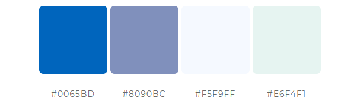

# The Flying Scotsmen (WIP)

The Flying Scotsmen is a site for a fictional flying group based in Scotland. It provides a booking and contact platform for the members of the group. 

The live site can be viewed [here!](https://the-flying-scotsmen.herokuapp.com/)

# Contents

* [**User Experience UX**](<#user-experience-ux>)
    *  [User Stories](<#user-stories>)
    * [Wireframes](<#wireframes>)
    * [Site Structure](<#site-structure>)
    * [Design Choices](<#design-choices>)
    *  [Typography](<#typography>)
    *  [Colour Scheme](<#colour-scheme>)
* [**Data Model**](<#data-model>)
    * [Class Based Views](<#class-based-views>)
* [**Features**](<#features>)
    * [**Home**](<#home-page>)
         * [Navigation bar](<#navigation-bar>)
         * [Gallery Carousel](<#gallery-carousel>)
         * [About-us](<#about-us>)
         * [Footer](<#footer>)
    * [**Calendar**](<#calendar>)
        *
    * [**Bookings**](<#bookings>)
        *
    * [**Contact**](<#contact>)
       * Contact details
       * Location map
       * Contact Form form
       * Testimonials
    * [**Form Confirmation**](<#form-confirmation>)
    * [**Future Features**](<#future-features>)
* [**Technologies Used**](<#technologies-used>)
* [**Testing**](<#testing>)
* [**Deployment**](<#deployment>)
* [**Credits**](<#credits>)
    * [**Content**](<#content>)
    * [**Media**](<#media>)
*  [**Acknowledgements**](<#acknowledgements>)

# User Experience (UX)

## User Stories
* As a USER I can MAKE A BOOKING so that I CAN USE THE GROUP AIRCRAFT TO FLY.

* As a USER I can VIEW A CALENDAR OF BOOKINGS so that I CAN SEE AVAILABILITY OF AIRCRAFT.

* As a USER I can CANCEL A BOOKING so that I HAVE FLEXIBILITY WHEN BOOKING.

* As a USER I can EDIT A BOOKING so that I CAN CHANGE MY BOOKING DETAILS.

* As a USER I can REGISTER WITH THE SITE so thank I CAN MAKE BOOKINGS.

* As a USER I can SEE WHAT AIRCRAFT THE GROUP OPERATES so that I CAN DECIDE IF I REGISTER.

* As a USER I can LOGIN/LOGOUT so that I CAN VIEW, MAKE AND EDIT MY BOOKINGS.

* As an ADMIN I can VIEW BOOKINGS so that I CAN MAKE SURE THE AIRCRAFT ARE AVAILABLE.

* As an ADMIN I can EDIT BOOKINGS so that I CAN CONTACT THE USERS IS THE CONDITIONS CHANGE.

* As an ADMIN I can BOOK SLOTS so that THE AIRCRAFT HAVE PREPOPULATED SLOTS FOR MAINTAINANCE.

[Back to top](<#contents>)

## Wireframes

* Home page 

* Calendar page

* Bookings page

* Contact page

[Back to top](<#contents>)

## Site Structure

The Flying Scotsmen project is made up of 4 main pages. [index](templates/booking/index.html), [calendar](templates/booking/calendar.html), [bookings](templates/booking/bookings.html) and [contact](templates/booking/contact.html). It also has a number of ancillary pages related to log-in, register, sign-up and log-out.

[Back to top](<#contents>)
## Design Choices

 * ### Typography
    * The pronciple font family is a sans-serif font, 'Poppins' from [Google fonts](https://fonts.google.com/specimen/Poppins?query=poppins#standard-styles). It is an easy to read font and doesn't distract the user from the content of the site.

 * ### Colour Scheme
    * The colour scheme was chosen to reflect the heritage of The Flying Scotsmen. The below palate was based upon the Blue used in the Scottish Flag (Pantone 300 / #0065BD). This gives the site an appealing and familiar look to the users.

     

[Back to top](<#contents>)

# Data Model
   * The Flying Scotsmen has been created around the principle of MVC (Model, View and Controller). It comprises a database with relationships between the various models 
    (represented by tables in the database). The models are, Custom User(using the default User model as a base), Group Member, Booking, Slot, Aircraft and Contact. The views then render the models in a way dictated by the Controllers, represented in this case by the respective URLs and other user interactions.
    

[Back to top](<#contents>)
# Features

## Existing Features

### Home

  * #### Navigation Bar

    * For displays over 980px the Navigation Bar is sited vertically on the left hand edge of all the pages. The Nav Bar can be toggled to expand to show the full name of the link instead of just the icon (default view) by clicking on the cheveron at the top of the Nav Bar.
    
    * For displays smaller than 980px the Nav Bar moves to a more traditional place at the top of the screen, with the links hidden and activated by a burger button to expand the menu for space saving.
    

Screenshots

    
    
    

    

[Back to top](<#contents>)

  * #### Gallery Carousel

    * Located on the home page beneath the title section. It was intended to make the title section relatively plain to enable a focus on the images in the gallery.
    * A responsively styled carousel of images of group photos of the aircraft and the various adventures the group has had.
    

Screenshots

    #
    

[Back to top](<#contents>)

  * #### About-Us
    * The About Us section lets the user know what The Flying Scotsmen is.
    * An inbedded link to the Register page will help the user navigate quickly to the next step of the project process. If the user is already registered, the link will navigate to the Contact page.

    

Screenshots

    #
    

[Back to top](<#contents>)

* #### Footer
    * A basic, semi-transparent footer displaying copyright information.

[Back to top](<#contents>)

### Calendar page

* #### Calendar
    * An advanced model of the basic HTML Calendar. It contains features like, highlighted current day, color coded days representing the booking availability on that day and buttons to display the bookings on the selected day.
    * The page also has a 'Previous' and 'Next' month buttons for navigating the calendar.
    * On larger screen sizes the a simplified booking is displayed on the calender for enhanced UX.
    * When a date is clicked, a modal will appear at the top of the page displaying the bookings for that date. If there are no bookings, the modal will display accordingly. Each booking will display alongside an edit and a cancel booking button (only available if these bookings belong to the logged in user).

    

Screenshots

    #
    

[Back to top](<#contents>)

### Bookings

* #### Booking Display
    * At the top of the booking page is the list of bookings for the current logged in user.
    * The display has all the information pertinant to that booking as well as the edit and cancel buttons.
    * If there are no buttons there is some text explaining that the bookings will appear once approved by admin.

    

Screenshots

        #
    

* #### Booking form
    * To make a new booking there is a form underneath the Booking display. It uses the logged-in users' username for the booking but the rest of the form is selectable. The booking information is then stored in the database pending admin approval. 

    

Screenshots

        #
    

[Back to top](<#contents>)

### Contact

* #### Contact Details

    

Screenshots

        #
    

[Back to top](<#contents>)
* #### Location Map

    

Screenshots

        #
    

[Back to top](<#contents>)

* #### Contact Form

    

Screenshots

        #
    

[Back to top](<#contents>)

* #### Testimonials

    * The testimonials section provides the user with some feedback from current group members. There are three testimonials displayed giving a name, flying experience and some text.
    * The testimonals will be updated as more recent testimonials become available.

    

Screenshots

        #
    

[Back to top](<#contents>)
## Future Features 

[Back to top](<#contents>)

# Technologies Used
* [Python](https://docs.python.org/3/contents.html) - primary language of the application.
* [HTML5](https://html.spec.whatwg.org/) - provides the content and structure for the website.
* [CSS](https://www.w3.org/Style/CSS/Overview.en.html) - provides the styling.
* [Django](https://www.djangoproject.com/) - Django framework for the project.
* [Bootstrap](https://getbootstrap.com/) - Design toolkit.
* [GitHub](https://github.com/) - to host the repositories.
* [Gitpod](https://www.gitpod.io/) - as the IDE for the application.
* [Lucid Charts](https://www.lucidchart.com/) - to create the flow diagram.
* [Balsamiq](https://balsamiq.com/wireframes/) - used to create the wireframes.
* [Google Cloud](https://cloud.google.com/) - to create a project for the API.
* [PEP8](http://pep8online.com/) - for testing and validating the code.
* [W3C Validator](https://validator.w3.org/) - test and code validation.
* [Animate CSS](https://animate.style/) - for animations.
* [DrawSQL](https://drawsql.app/) - for the database diagram.
* [IconFinder](https://www.iconfinder.com/) - for favicon.
* [FlatPickr](https://flatpickr.js.org/) - Used as a date interface, provides advanced features at the front end.
* [Jest](https://jestjs.io/) - Testing framework for JavaScript.

[Back to top](<#contents>)

# Testing

Please refer to [**_here_**](TESTING.md) for more information on testing.

[Back to top](<#contents>)

# Deployment

### **To deploy using [Heroku](https://www.heroku.com/):**

1. Ensure your requirements.txt file has the required dependencies. To do this you can use the following code in your IDE:
    > pip3 freeze > requirements.txt
    - Heroku will use this file to import the dependencies that are required.
3. Create or Login to your Heroku account.
4. Navigate to Dashboard. 
5. Click "New" and select "create new app" from the drop-down menu. This is found in the upper right portion of the window. 
6. Provide a unique name for your application and select your region.
7. Click "Create App".

### **To use the Heroku Postgres database:**

1. Navigate to the "Resources" tab. Once there, in the search box type "Postgres". 
2. You will then be able to attach this to the App you have just created.

### Setting up the App within Heroku

1. Navigate to "Settings" and scroll down to "config vars".
2. There are a number of config vars for this project, API_KEY, CLOUDINARY_URL, DATABASE_URL, EMAIL_PASSWORD and a SECRET_KEY.
3. The config vars are specific to the local project. They are usually unique and often provided by the respective API in use.

### App Deployment

1. Navigate to the "Deploy" section.
2. Scroll down to "Deployment Method" and select "GitHub".
3. Authorise the connection of Heroku to GitHub.
4. Search for your GitHub repository name, and select the correct repository.
5. For Deployment there are two options, Automatic Deployments or Manual.
    - Automatic Deployment: This will prompt Heroku to re-build your app each time you push your code to GitHub.
    - Manual Deployment: This will only prompt Heroku to build your app when you manually tell it to do so. 
6. Ensure the correct branch is selected "master/Main", and select the deployment method that you desire.

### **To fork the repository on GitHub**
A copy of the GitHub Repository can be made by forking the repository. This copy can be viewed and changes can be made to the copy without affecting the original repository. Take the following steps to fork the repository;
1. Log in to **GitHub** and locate the [repository](https://github.com/EwanColquhoun/the-flying-scotsmen).
2. On the right hand side of the page inline with the repository name is a button called **'Fork'**, click on the button to create a copy of the original repository in your GitHub Account.

### **To create a local clone of this project**
The method for cloning a project from GitHub is below:

1. Under the repository’s name, click on the **code** tab.
2. In the **Clone with HTTPS** section, click on the clipboard icon to copy the given URL.

3. In your IDE of choice, open **Git Bash**.
4. Change the current working directory to the location where you want the cloned directory to be made.
5. Type **git clone**, and then paste the URL copied from GitHub.
6. Press **enter** and the local clone will be created.

[Back to top](<#contents>)

# Credits
### Content

* The font came from [Google Fonts](https://fonts.google.com/).
* The Contact map is embedded from [Google Maps](https://www.google.com/maps).
* The colour palate was compiled by [Colormind](http://colormind.io/).
* The icons came from [Font Awesome](https://fontawesome.com/).
* [PhoneNumberField](https://github.com/stefanfoulis/django-phonenumber-field) was used to validate the Contact form Telephone field.

### Media
* [Unsplash](https://unsplash.com/) - Stock Cessna Photos
* William MacLeod - Photos of G-BSAI.

[Back to top](<#contents>)

# Acknowledgements
The site was completed as a Portfolio 4 Project piece for the Full Stack Software Developer (e-Commerce) Diploma at the [Code Institute](https://codeinstitute.net/). As such I would like to thank my mentor [Precious Ijege](https://www.linkedin.com/in/precious-ijege-908a00168/), the Slack community, and all at the Code Institute for their help and support. The FLying Scotsmen is a fictional group, however the site could be adapted with very little effort to reflect a fully functional Aircraft Management Group.

Ewan Colquhoun 2022.

[Back to top](<#contents>)