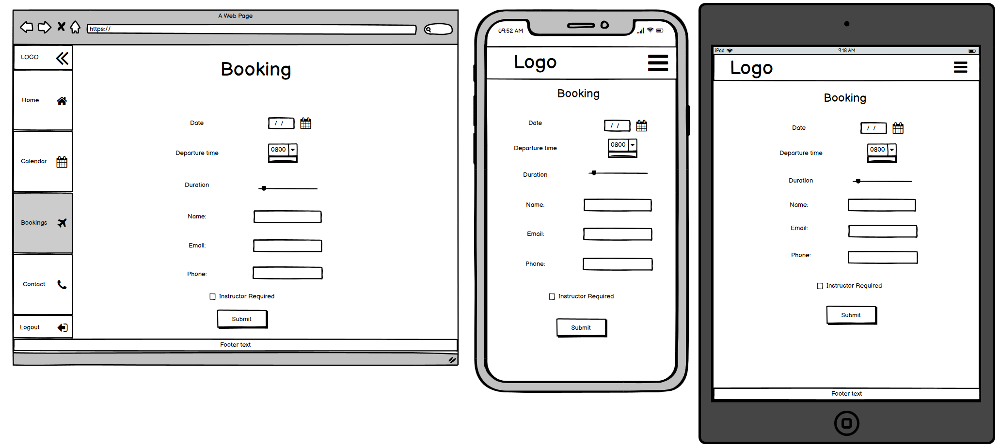

# The Flying Scotsmen (WIP)

The Flying Scotsmen is a site for a fictional flying group based in Scotland. It provides a booking and contact platform for the members of the group. 

The live site can be viewed [here!](https://the-flying-scotsmen.herokuapp.com/)

# Contents

* [**User Experience UX**](<#user-experience-ux>)
    *  [User Stories](<#user-stories>)
    * [Wireframes](<#wireframes>)
    * [Site Structure](<#site-structure>)
    * [Design Choices](<#design-choices>)
    *  [Typography](<#typography>)
    *  [Colour Scheme](<#colour-scheme>)
* [**Features**](<#features>)
    * [**Home**](<#navigation-menu>)
         * [Navigation menu](<#navigation-menu>)
         * [Gallery](<#gallery>)
         * [About-us](<#about-us>)
         * [Testimonials](<#testimonials>)
         * [Footer](<#footer>)
    * [**Projects**](<#projects>)
        * Dolls Cots
        * Height Chart
        * Walker
    * [**Inspiration**](<#inspiration>)
        * Elm
        * Oak
        * Elm
    * [**Contact Us**](<#contact-us>)
       * Contact details
       * Location map
       * Design Query form
    * [**Form Confirmation**](<#form-confirmation>)
    * [**Future Features**](<#future-features>)
* [**Technologies Used**](<#technologies-used>)
* [**Testing**](<#testing>)
* [**Deployment**](<#deployment>)
* [**Credits**](<#credits>)
    * [**Content**](<#content>)
    * [**Media**](<#media>)
*  [**Acknowledgements**](<#acknowledgements>)

# User Experience (UX)

## User Stories
* As a USER I can MAKE A BOOKING so that I CAN USE THE GROUP AIRCRAFT TO FLY.

* As a USER I can VIEW A CALENDAR OF BOOKINGS so that I CAN SEE AVAILABILITY OF AIRCRAFT.

* As a USER I can CANCEL A BOOKING so that I HAVE FLEXIBILITY WHEN BOOKING.

* As a USER I can EDIT A BOOKING so that I CAN CHANGE MY BOOKING DETAILS.

* As a USER I can REGISTER WITH THE SITE so thank I CAN MAKE BOOKINGS.

* As a USER I can SEE WHAT AIRCRAFT THE GROUP OPERATES so that I CAN DECIDE IF I REGISTER.

* As a USER I can LOGIN/LOGOUT so that I CAN VIEW, MAKE AND EDIT MY BOOKINGS.

* As an ADMIN I can VIEW BOOKINGS so that I CAN MAKE SURE THE AIRCRAFT ARE AVAILABLE.

* As an ADMIN I can EDIT BOOKINGS so that I CAN CONTACT THE USERS IS THE CONDITIONS CHANGE.

* As an ADMIN I can BOOK SLOTS so that THE AIRCRAFT HAVE PREPOPULATED SLOTS FOR MAINTAINANCE.

[Back to top](<#contents>)

## Wireframes

* Home page 

* Calendar page

* Bookings page

* Contact page

[Back to top](<#contents>)

## Site Structure

The Flying Scotsmen project is made up of 4 main pages. [index](templates/booking/index.html), [calendar](templates/booking/calendar.html), [bookings](templates/booking/bookings.html) and [contact](templates/booking/contact.html). It also has a number of ancillary pages related to log-in, register, sign-up and log-out.

[Back to top](<#contents>)
## Design Choices

 * ### Typography

 * ### Colour Scheme

[Back to top](<#contents>)
# Features

## Existing Features

### Home page

  * #### Navigation Bar

    * For displays over 980px the Navigation Bar is sited vertically on the left hand edge of all the pages. The Nav Bar can be toggled to expand to show the full name of the link instead of just the icon (default view) by clicking on the cheveron at the top of the Nav Bar.
    
    * For displays smaller than 980px the Nav Bar moves to a more traditional place at the top of the screen, with the links hidden and activated by a burger button to expand the menu for spaace saving.
    

[Back to top](<#contents>)

  * #### Gallery Carousel

      * Located on the home page beneath the title section. It was intended to make the title section relatively plain to enable a focus on the images in the gallery.
      * A responsively styled carousel of images of group photos of the aircraft and teh various adventures the group has had.

[Back to top](<#contents>)

  * #### About-Us
    * The About Us section lets the user know what The Flying Scotsmen is.
    * An inbedded link to the contact page will help the user navigate quickly to the next step of the project process.

[Back to top](<#contents>)

* #### Footer
    * A basic, semi-transparent footer displaying copyright information.

[Back to top](<#contents>)

### Calendar page

* #### Calendar
    * An advanced model of the basic HTML Calendar. It contains features like, highlighted current day, color coded days representing the booking availability on that day and buttons to display the bookings on the selected day.
    * The page also has a 'Previous' and 'Next' month buttons for navigating the calendar.
    * On larger screen sizes the a simplified booking is displayed on the calender for enhanced UX.
    * When a date is clicked, a modal will appear at the top of the page displaying the bookings for that date. If there are no bookings, the modal will display accordingly. Each booking will display alongside an edit and a cancel booking button (only available if these bookings belong to the logged in user).

[Back to top](<#contents>)

### Bookings

* #### Booking Display
    * At the top of the booking page is the list of bookings for the current logged in user.
    * The display has all the information pertinant to that booking as well as the edit and cancel buttons.
    * If there are no buttons there is some text explaining that the bookings will appear once approved by admin.

* #### Booking form
    * To make a new booking there is a form underneath the Booking display. It uses the logged-in users' username for the booking but the rest of the form is selectable. The booking information is then stored in the database pending admin approval. 

[Back to top](<#contents>)

### Contact Us

[Back to top](<#contents>)

* ### Form Confirmation

[Back to top](<#contents>)

* #### Testimonials

    * The testimonials section provides the user with some feedback from current group members. There are three testimonials displayed giving a name, flying experience and some text.
    * The testimonals will be updated as more recent testimonials become available.

[Back to top](<#contents>)
## Future Features 

[Back to top](<#contents>)

# Technologies Used
* [HTML5](https://html.spec.whatwg.org/) - provides the content and structure for the website.
* [CSS](https://www.w3.org/Style/CSS/Overview.en.html) - provides the styling.
* [Balsamiq](https://balsamiq.com/wireframes/) - used to create the wireframes.
* [Gitpod](https://www.gitpod.io/#get-started) - used to deploy the website.
* [Github](https://github.com/) - used to host and edit the website.

[Back to top](<#contents>)

# Testing

Please refer to [**_here_**](TESTING.md) for more information on testing.

[Back to top](<#contents>)

# Deployment

### **To deploy the project**
The site was deployed to GitHub pages. The steps to deploy a site are as follows:
  1. In the GitHub repository, navigate to the **Settings** tab.
  2. Once in Settings, navigate to the **Pages** tab on the left hand side.
  3. Under **Source**, select the branch to **master**, then click **save**.
  4. Once the master branch has been selected, the page will be automatically refreshed with a detailed ribbon display to indicate the successful deployment.

  The live link to the Github repository can be found here - https://github.com/EwanColquhoun/wawaswoods

### **To fork the repository on GitHub**
A copy of the GitHub Repository can be made by forking the GitHub account. This copy can be viewed and changes can be made to the copy without affecting the original repository. Take the following steps to fork the repository;
1. Log in to **GitHub** and locate the [repository](https://github.com/EwanColquhoun/wawaswoods).
2. On the right hand side of the page inline with the repository name is a button called **'Fork'**, click on the button to create a copy of the original repository in your GitHub Account.

### **To create a local clone of this project**
The method from cloning a project from GitHub is below:

1. Under the repository’s name, click on the **code** tab.
2. In the **Clone with HTTPS** section, click on the clipboard icon to copy the given URL.

3. In your IDE of choice, open **Git Bash**.
4. Change the current working directory to the location where you want the cloned directory to be made.
5. Type **git clone**, and then paste the URL copied from GitHub.
6. Press **enter** and the local clone will be created.

[Back to top](<#contents>)

# Credits
### Content

* The font came from [Google Fonts](https://fonts.google.com/).
* The map is embedded from [Google Maps](https://www.google.com/maps).
* The colour palate was compiled by [Colormind](http://colormind.io/).
* The icons came from [Font Awesome](https://fontawesome.com/).
* The form validation idea came from a [YouTube tutorial](https://www.youtube.com/watch?v=fNcJuPIZ2WE).
* The code for the Safari specific styling was inspired by an example on [Stack Overflow](https://stackoverflow.com/).
* The inspiration for the Project page sliders came from this repository on [GitHub](https://gist.github.com/zhilinskiy/4603199).
* [Balsamiq](https://balsamiq.com/wireframes/) was used to create the wireframes.

### Media

[Back to top](<#contents>)

# Acknowledgements
The site was completed as a Portfolio 1 Project piece for the Full Stack Software Developer (e-Commerce) Diploma at the [Code Institute](https://codeinstitute.net/). As such I would like to thank my mentor [Precious Ijege](https://www.linkedin.com/in/precious-ijege-908a00168/), the Slack community, and all at the Code Institute for their help and support. Wawas Woods is a fictional company but it exists in everything but the business title. Currently it is more of a hobby!

Ewan Colquhoun 2021.

[Back to top](<#contents>)