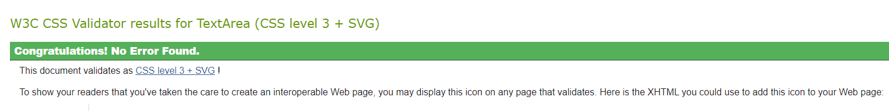
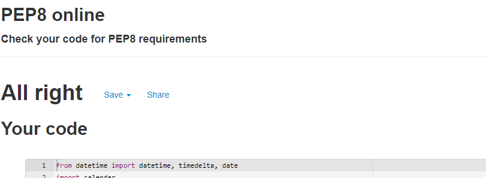
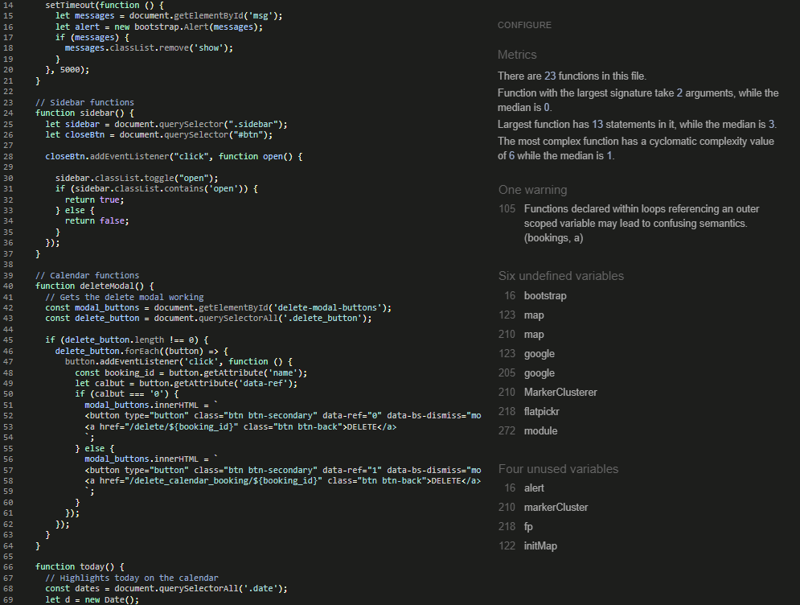
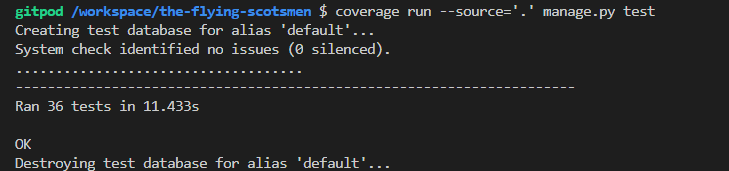
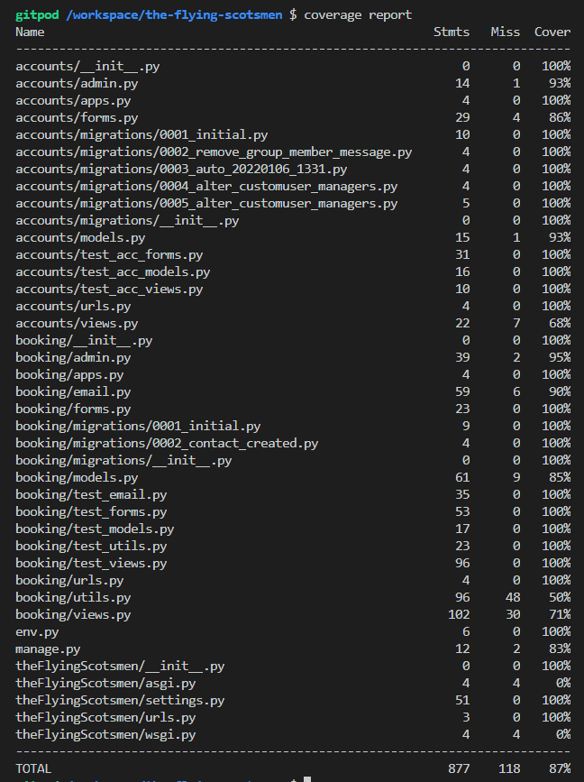
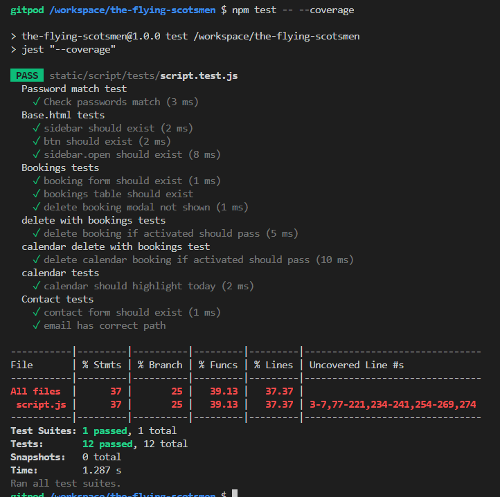
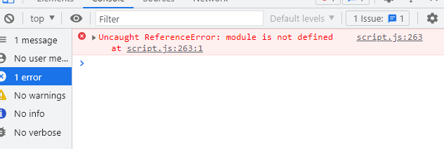
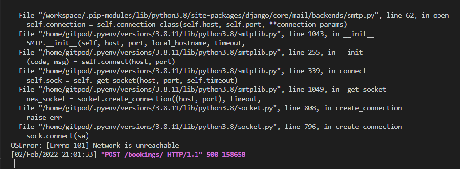

# Testing for The Flying Scotsmen

## Contents

* [Code Validation](<#code-validation>)
* [Automated Testing](<#automated-testing-with-jest-and-unittest>)
* [Responsiveness Test](<#responsiveness-test>)
* [Browser Compatibility](<#browser-compatibility>)
* [Testing User Stories](<#testing-user-stories>)
* [Known Bugs](<#known-bugs>)
* [Additional Testing](<#additional-testing>)

## Code Validation
The Flying Scotsmen has be throughly tested. All the code has been run through the [W3C html validator](https://validator.w3.org/), the [W3C CSS validator](https://jigsaw.w3.org/css-validator/) and the [JavaScript JSHint validator](https://jshint.com/). 
The code passed the W3C Validator barring all the django template tags. Outside of those, no errors were found.
The CSS passed the W3C Validator passed once an error with the 'transition-timing-function' propery was corrected (from '1000ms' to 'ease-in').
After some minor re-formatting the script passed the JSHint tests. There are some warnings about unused variables, however these are related to bootstrap, the googlemaps api and the flatpicker add-on. 

* CSS Validation

* Pep8 Validation for booking/views.py but same result for all custom .py files.

* JSHint results

[Back to top](<#contents>)
## Automated testing with Jest and Unittest

The automated testing for The Flying Scotsmen was completed using the Django built in test library Unittest, more specifically the TestCase class. The tests cover form, models and views. Overall test coverage is at 87% for the Python based files. 
Jest was used for the testing with JavaScript. There are a number of external sources used (Google Maps, Flatpickr, Bootstrap) so I haven't endeavoured to test those items within my code. The coverage of the script file as a whole is at 37%.

* UnitTest for Django

* Jest for JavaScript

[Back to top](<#contents>)
## Responsiveness Test

The responsive design tests were carried out manually with [Google Chrome DevTools](https://developer.chrome.com/docs/devtools/).

|        | Moto G4 | Galaxy S5 | iPhone 5 | iPad | iPad Pro | Display <1200px | Display >1200px |
|--------|---------|-----------|----------|------|----------|-----------------|-----------------|
| Render | pass    | pass      | pass     | pass | pass     | pass            | pass            |
| Images | pass    | pass      | pass     | pass | pass     | pass            | pass            |
| Links  | pass    | pass      | pass     | pass | pass     | pass            | pass            |

[Back to top](<#contents>)
## Browser Compatibility
* The Flying Scotsmen application has been tested on Chrome, Edge, Safari and Firefox. During development the various webkits were used with the existing CSS to help prevent browser compatability issues. The Animate CSS library was used to help make the animations functional on all browsers. 

[Back to top](<#contents>)
## Testing User Stories
* As a USER I can MAKE A BOOKING so that I CAN USE THE GROUP AIRCRAFT TO FLY.
    - Once you are registered and approved by the Admin. The User can then access the Booking page by the Navigation menus. On the Bookings page the Approved User can then make bookings. 

* As a USER I want to VIEW A CALENDAR OF BOOKINGS so that I CAN SEE AVAILABILITY OF AIRCRAFT.
    - Once you are registered and approved by the Admin. The User can then access the Calendar page by the Navigation menus. On the Calendar page the Approved User can view all the bookings that have been both approved and awaiting approval.  

* As a USER I want to CANCEL A BOOKING so that I HAVE FLEXIBILITY WHEN BOOKING.
    - On both the Booking page and the Calendar page the user can click on a 'Delete booking' icon. They will then be prompted to check that they want to proceed with the cancellation. 

* As a USER I want to EDIT A BOOKING so that I CAN CHANGE MY BOOKING DETAILS.
    - On both the Booking page and the Calendar page the user can click on an 'edit booking' icon and be taken to the edit-booking page to amend their booking.

* As a USER I want to REGISTER WITH THE SITE so thank I CAN MAKE BOOKINGS.
    - On the home page there is a link to a Register page. Here the user can submit a form making a case to join the group. That information is then passed to the Admin for approval.

* As a USER I want to SEE WHAT AIRCRAFT THE GROUP OPERATES so that I CAN DECIDE IF I REGISTER.
    - On the home page there is some information about the group and the aircraft they operate. It gives the user a basic understanding of what the aircraft capabilities are.

* As a USER I want to LOGIN so that I CAN VIEW, MAKE AND EDIT MY BOOKINGS.
    - From any page a Login page can be accessed by the bottom most button in the navigation menus. This will take the User to a login page, or if they are already logged in, if clicked, it will log the user out.

* As an ADMIN I want to VIEW BOOKINGS so that I CAN MAKE SURE THE AIRCRAFT ARE AVAILABLE.
    - Once logged into the Admin page of the site the Admin can approve, view, amend, and cancel the bookings.

* As an ADMIN I want to EDIT BOOKINGS so that I CAN CONTACT THE USERS IF THE CONDITIONS CHANGE.
    - Once logged into the Admin page of the site the Admin can approve, view, amend, and cancel the bookings.

* As an ADMIN I want to BOOK SLOTS so that THE AIRCRAFT HAVE PREPOPULATED SLOTS FOR MAINTAINANCE.
    - In the Admin page the Admin has access to all the inner workings of the booking system. If the group gets more aircraft, the Admin can add these on with little effort. If more slots become available, again, the Admin can add more slots. If Admin needs to book an aircraft out for maintance or test flights this is also possible on both the Admin site and the main site once logged in as Admin.

[Back to top](<#contents>)
## Known Bugs
* ### Resolved
    There were a number of bugs that were overcome during the development process. 
    1. The availability panel on the calendar page. The Calendar in the template tags isn't recognised by the availability section so it was difficult to find the problem and then develop a fix. The fix was to position it absolutley to the page and not the other block elements.

    2. I wanted to add a message to be associated with the new user on the sign-up page. I tried submitting it as a separate form but that wasn't the ideal solution. The fix was to modify the default User class. Then modify the default sign-up form. 

    3. During testing a console error relating to 'Module is not recognised'. After some investigation it was discovered that there were incompatibility issuse with the script.js and the script.jest.js files.
     
    Initially I attemped to remove 'module.exports = {myFunctions}' and replace it with 'export {myFunctions}'. This removed the console error but caused the test file to fail (see next bug!).

    

    4. Now that the module error was removed. The next task was to get the script.test.js file to run and pass all tests. This was a bit more complicated, the problem seems widespread and the fixes seem very dependent on the rest of the code setup. After trying numerous 'fixes' ranging from renaming the .js files to .mjs files to setting up jest.config.js files.
    The ultimate fix in this case was to create a babel.config.js file and to include the following;
     
     

    > // babel.config.js //
        module.exports = {
        presets: [
            [
            '@babel/preset-env',
            {
                targets: {
                node: 'current',
                },
            },
            ],
            ["@babel/preset-react"],
        ],
        };

    The issue seems to stem from the transferring of the common JS into a format readable by ES Modules. Jest/Babel seems to need configuring to accept the ES6 variation of JS. 

* ### Unresolved
    * At the time of writing there is one bug that might detract from the User Experience over the long term. On the Bookings page, currently all the bookings are displayed with the latest being at the top. As the number of bookings increase, the application will continue to display all the existing bookings. This will eventually take up memory and thus time. The most recent bookings are readily visible. For convenience it would be nice to only display the previous 6 months bookings for example. 

    * When the application is viewed in a development environment (In this case, port 8000 with GitPod) the email function will not work. The server fails to connect to the email ports (tried ports 587 and 465). Upon further investigation it appears that GitPod have blocked the access on those ports recently to prevent attacks. The work around to get the tests to run and pass is to assign another EMAIL_BACKEND environmental variable for testing purposes As well as the following code in the views to bypass the sending of email in the development environment.
    
    > if 'runserver' in sys.argv:

    As the email functionality isn't crucial for the application whilst in the development environment this bug will we investigated further after final deployment. 
     
    The error message is below:

    

[Back to top](<#contents>)
## Additional Testing
### Lighthouse
The site was also tested using [Google Lighthouse](https://developers.google.com/web/tools/lighthouse) in Chrome Developer Tools to test each of the pages for:
* Performance - How the page performs whilst loading.
* Accessibility - Is the site acccessible for all users and how can it be improved.
* Best Practices - Site conforms to industry best practices.
* SEO - Search engine optimisation. Is the site optimised for search engine result rankings.

Here are the results from The Flying Scotsmen test;

 
This part of the testing process showed up that the site was slow to load. All the images were compressed and the 'prefectch' function was added to the link elements in the head of the INDEX.page. This sped up the loading time and increased the performance rating.

### Peer review
The Flying Scotsmen Application has been tested by Peers both in the software development field and external to it. The feedback has generally been positive but with minor points cropping up from time to time. A common one has been 'Server Errors(500)' whilst trying to register or send a contact message. This was found to have been caused by the command to send the email associated with the request. The fix was to change the security settings on the gmail account registered to the application to allow access from low security applications and two factor login and the email side. This poses no problems for the user, it means that the admin of the functional email address would need to complete the extra login steps.

Back to [README.md](./README.md#testing).

[Back to top](<#contents>)